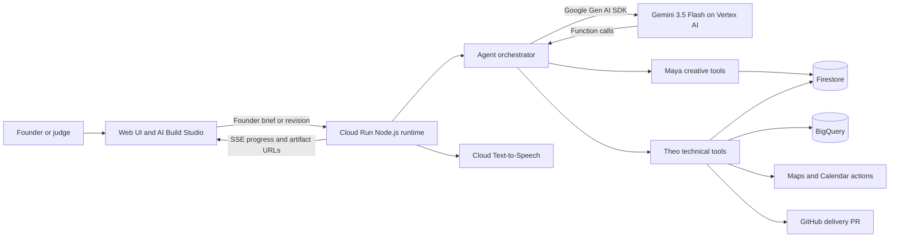

# Cofounder Live

Cofounder Live turns one founder brief into a published investor page and an interactive product concept. Maya, the Creative Cofounder, defines and reviews the experience. Theo, the Technical Cofounder, builds, revises, and publishes it.

## Submission links

- **Live application:** https://nano-banana-guide-26967920041.us-central1.run.app
- **Source repository:** https://github.com/stalkiq/cofounderlive
- **Generated product deliveries:** https://github.com/stalkiq/cofounderlive-deliveries
- **Example autonomous delivery:** https://github.com/stalkiq/cofounderlive-deliveries/pull/3
- **Demo video:** Add the public YouTube or Vimeo URL before Devpost submission

## Hackathon track

All Things Agentic · **Taskmaster** — one goal enters; deployed artifacts come out.

This is an agentic workflow, not a chat wrapper. Gemini chooses and calls application tools, observes their results, and continues until the required artifact has been reviewed and revised.

## Problem and value proposition

Founders can describe an idea, but turning it into something reviewable usually requires disconnected branding, product, engineering, testing, deployment, and repository work. Cofounder Live gives the founder two collaborating AI agents that complete that workflow visibly.

Maya protects product clarity and design quality. Theo turns the approved direction into durable artifacts, selects a useful Google capability, deploys the concept, and packages a clean repository delivery. The founder can inspect every tool action and continue revising the product in AI Build Studio.

## Features

- Two role-specialized, voice-enabled AI cofounders
- Autonomous function-calling workflows with tool-result feedback
- Published investor landing pages with evidence guards
- Product-specific interactive concepts rather than a fixed dashboard template
- Automatic Google Maps, Calendar, BigQuery, or Gemini capability selection
- Persistent revisions and project restoration through Firestore
- Live progress through Server-Sent Events
- AI Build Studio for iterative product changes
- Portable ZIP exports with deployment files
- Idempotent GitHub branches and pull requests for finished revisions

### Landing-page workflow

1. Maya calls `create_visual_direction`.
2. Theo calls `publish_landing_page`.
3. Maya calls `review_landing_page`.
4. Theo calls `revise_landing_page` and returns the durable URL.

### Product-concept workflow

1. Theo calls `build_mvp`.
2. Maya calls `review_mvp`.
3. Theo calls `revise_mvp`.
4. Theo includes one product-appropriate Google capability.
5. The founder can continue iterating in AI Build Studio, download the code, or create a reviewable GitHub delivery PR.

## Autonomous Google capabilities

Theo selects exactly one capability based on the founder brief and aligns it with a compatible product screen:

- **Google Maps** for place-based discovery, routes, logistics, and field work
- **Google Calendar** for appointments, shifts, reservations, and time-based coordination
- **BigQuery** for product-specific sample operations data and live analytics
- **Gemini** for recommendations, planning, summarization, and product copilots

Maps and Calendar use official Google destinations without requesting account access. BigQuery uses mission-specific tables through the Cloud Run service account. Gemini uses the existing Vertex AI runtime.

## GitHub delivery

AI Build Studio can package the current revision into a clean repository folder containing the interface, product specification, README, deployment guide, Dockerfile, and nginx configuration. Theo creates one idempotent pull request per mission revision in the configured fixed delivery repository.

The Cloud Run runtime requires a fine-grained GitHub token limited to the delivery repository with **Contents: Read and write** and **Pull requests: Read and write**. Store it in Secret Manager and expose it as `GITHUB_DELIVERY_TOKEN`; do not commit it or use a broad personal token.

## Approved Google agent framework

The agent runtime uses the official **Google Gen AI SDK for JavaScript** (`@google/genai`). The SDK handles Vertex AI authentication, Gemini generation, structured JSON, and function calling. Cofounder Live executes the requested tools and sends their results back to Gemini for the next autonomous step.

There are no custom REST calls to Vertex AI and no Gemini API key. Cloud Run uses Application Default Credentials with the project service account, so model usage is billed to the configured Google Cloud project.

## Google Cloud stack

- Gemini 3.5 Flash on Vertex AI through `@google/genai`
- Cloud Run for the web app and agent runtime
- Firestore for published pages, product concepts, and revision history
- BigQuery for mission-specific sample analytics selected by Theo
- Cloud Text-to-Speech for distinct cofounder voices
- Secret Manager for the optional repository-scoped GitHub credential
- Server-Sent Events for live tool and agent progress

## Architecture



Gemini decides which declared tool to call next. The Node.js orchestrator executes that tool, persists its result, and returns the structured function response to Gemini. The loop only completes after the required review and revision stages produce a durable artifact.

## Run locally

Requirements:

- Node.js 20+
- Google Cloud CLI
- A Google Cloud project with billing enabled
- Application Default Credentials with Vertex AI and Firestore access

```bash
git clone https://github.com/stalkiq/cofounderlive.git
cd cofounderlive
npm install
gcloud auth application-default login
gcloud config set project YOUR_PROJECT_ID
gcloud services enable \
  aiplatform.googleapis.com \
  bigquery.googleapis.com \
  firestore.googleapis.com \
  texttospeech.googleapis.com
export GOOGLE_CLOUD_PROJECT=YOUR_PROJECT_ID
npm start
```

Open `http://localhost:8080`. The health endpoint reports the active provider, SDK, project, location, and model at `http://localhost:8080/health`.

## Deploy to Google Cloud Run

The runtime service account needs these roles:

- Vertex AI User
- Cloud Datastore User
- BigQuery Job User
- BigQuery Data Editor

Then deploy:

```bash
export GCP_PROJECT_ID=YOUR_PROJECT_ID
export GCP_REGION=us-central1
./deploy.sh
```

For GitHub delivery, create a fine-grained token restricted to one delivery repository. Give it **Contents: Read and write** and **Pull requests: Read and write**, then store it without committing it:

```bash
printf '%s' "$GITHUB_DELIVERY_TOKEN" | gcloud secrets create github-delivery-token \
  --data-file=- \
  --replication-policy=automatic \
  --project="$GCP_PROJECT_ID"
```

Grant the Cloud Run service account `roles/secretmanager.secretAccessor` on that secret and run `./deploy.sh` again. GitHub delivery is optional; all Google agent workflows work without it.

## Configuration

- `GOOGLE_CLOUD_PROJECT` or `GCP_PROJECT` — Google Cloud project
- `VERTEX_LOCATION` — Vertex AI location; defaults to `global`
- `GEMINI_MODEL` — model; defaults to `gemini-3.5-flash`
- `PUBLIC_BASE_URL` — deployed Cloud Run URL used for published artifacts
- `GOOGLE_TTS_ENABLED` — enables cofounder speech
- `BIGQUERY_DATASET` — mission-specific product analytics dataset; defaults to `cofounder_live`
- `BIGQUERY_LOCATION` — BigQuery dataset location; defaults to `US`
- `GITHUB_DELIVERY_TOKEN` — fine-grained token restricted to the delivery repository
- `GITHUB_DELIVERY_OWNER` — fixed repository owner; defaults to `stalkiq`
- `GITHUB_DELIVERY_REPO` — fixed repository name; defaults to `cofounderlive-deliveries`
- `GITHUB_DELIVERY_BASE` — pull-request base branch; defaults to `main`

## Data sources

- Founder-provided product briefs
- Gemini-generated fictional sample product data
- Firestore records created by the agent workflows
- BigQuery sample tables created for product concepts that need analytics

The application does not claim that generated sample data represents real customers, traction, partnerships, or market performance.

## Findings and learnings

- Reliable autonomy needs explicit completion criteria. The agent prompts require publish, review, and revision tools instead of allowing Gemini to stop after advice.
- Structured function responses make multi-agent handoffs inspectable and recoverable.
- Product differentiation improved when Gemini selected from controlled archetypes and screen primitives instead of generating arbitrary code.
- Google capabilities are most convincing when selected for a product reason and connected to an observable action.
- Durable Firestore state is necessary because Cloud Run instances are ephemeral.
- Evidence guards are essential in startup workflows because persuasive copy can otherwise turn unverified assumptions into apparent facts.

## Competition requirement checklist

- [x] **One category selected:** Taskmaster
- [x] **Gemini 3.5 or newer:** Gemini 3.5 Flash through Vertex AI
- [x] **Approved Google agent framework:** official Google Gen AI SDK for JavaScript
- [x] **Google Cloud infrastructure:** Cloud Run, Firestore, BigQuery, Secret Manager, and Cloud Text-to-Speech
- [x] **Complete autonomous workflow:** agents take actions, inspect tool results, review work, revise it, and publish artifacts
- [x] **Hosted project URL:** linked above
- [x] **Code repository:** this repository
- [x] **Reproducible spin-up and deployment instructions:** included above
- [x] **Architecture diagram:** included above
- [x] **Features, technologies, data sources, and learnings:** documented above
- [ ] **Public demo video of four minutes or less:** record in English, upload to YouTube or Vimeo, and add the URL above
- [ ] **Demo must visibly prove Google Cloud deployment:** show the live `.run.app` URL and Cloud Run or Vertex AI evidence
- [ ] **Devpost short description and final submission form:** copy the problem, value proposition, features, technologies, data sources, and learnings from this README

## Evidence and safety

Generated business claims are treated as hypotheses unless the founder supplied evidence. Downloaded product concepts include a notice that sample data is fictional and that the preview is not a production application.
